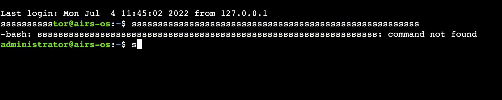
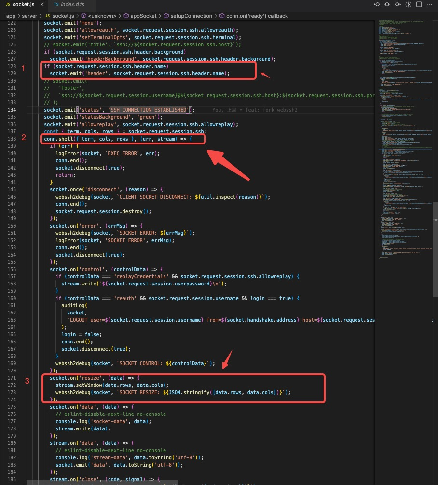

# webssh —— 浏览器上的终端
近期接到一个需求，实现一个运行在浏览器上的终端，用于快速连接到公司设备。

> tip：只求实现的可直接跳到 「最终方案」处。

需求有以下几点

> 1、设备都不在公网状态下  
> 2、webshell 需要免密登陆  
> 3、动态连接的端口、账号、密码  
> 4、可显示当前设备信息

使用 mac 的同学应该会更加熟悉，使用 windows 的同学可以把它理解为 power shell 或者理解为 vscode 的终端。

综合以上几点梳理出几点实现的要求

>1、设备不在公网状态下。说明没有公网 ip，不能 ssh 直连，需要跳板机  
>2、免密登陆、动态端口、显示信息。说明需要灵活可定制的工具

# 初步方案
webshell ➡️ 跳板机 ➡️ 设备

# 调研
如果买过服务器倒腾的同学应该都用过云服务商提供的 webshell 终端，用来免密、快速的连接自己的服务器。所以首先查看了阿里云、腾讯云等大场的云服务器的登陆终端，以求找到蛛丝马迹。

## 一、F12
使用前端传统艺能，打开控制面板，查看大厂 webshell 的 element、js 的引入包，找到了一个出现频率最高的 js 包 [xterm.js](https://github.com/xtermjs/xterm.js)。

## 二、顺藤摸瓜
查看 xtermjs 的 github 项目。Fork 数 1.3k，Start 数 13.2k。这是一个 webshell 的核心包，依赖此包开发的项目只是展示出来的就有 100 个左右。其中有很多明星项目，只是拿一个项目就能显示出这个库的重要性 **「Microsoft Visual Studio Code」（VsCode） 的终端就是以这个库为核心进行开发的。**

## 三、找个保熟的瓜
以上的信息说明核心项目找到了，需要找一个符合目前需求的衍生项目。在众多的衍生项目中确定目标 [WebSSH2](!https://github.com/billchurch/WebSSH2)。

理由如下
>1、Start 1.7k。 说明这个库的使用者不少，搜索了一下有一定量的参考文章  
>2、近期有更新。说明这个库还是一直在维护的  
>3、根据 README.md 初步运行项目基本符合需求  
>4、使用 Express + Socket + ssh2 + xtermjs 代码复杂度低，方便个人定制和部署

以上几点完全满足我接到的需求，也非常适合定制界面和添加业务逻辑。

## 开源项目的一些问题

### 1、明文传输
连接后的 ssh 域名、端口、账号、密码都是暴露在界面上的并不安全，url 动态传参也是使用的**明文传输**，这就直接**造成关键信息的泄漏**，需要进行**传参加密、页面显示的优化**。

### 2、初始化参数问题
https://github.com/billchurch/webssh2/blob/main/app/server/app.js
路径下的方法
```js
// app.js
setDefaultCredentials(config);

// util.js
// 这个方法的传参为用户信息的初始化
exports.setDefaultCredentials = function setDefaultCredentials({
  name: username,
  password,
  privatekey,
  overridebasic,
}) {
  defaultCredentials = { username, password, privatekey, overridebasic };
};

// config 中的用户信息在 user 对象中，所以传参 config 时的数据初始化是错误的，应改为
setDefaultCredentials(config.user);

```
以上方法在你选择**使用默认用户名密码的形式免密登陆时会用到**

该问题已经向作者提交 PR 并且在 2022.7.6 被合并

### 3、终端行列问题  
初始化时终端的行数及列数的函数未触发，导致在宽屏状态下的终端大小为初始状态而没有自适应为宽屏状态。导致输入较长参数时出现未自动切换下一行并且重复覆盖该行的参数



源代码触发 resizeScreen 位置在 
```js
// app/client/src/js/index.ts
socket.on('header', (data: string) => {
  if (data) {
    header.innerHTML = data;
    header.style.display = 'block';
    // header is 19px and footer is 19px, recaculate new terminal-container and resize
    terminalContainer.style.height = 'calc(100% - 38px)';
    resizeScreen();
  }
});
```
socket 中触发事件位置在下图第一步。而 ssh 初始化终端的行列时在第二步，而真正被触发并设置终端的事件在 conn.shell 事件中，也就是说虽然以设置 header 的事件去触发 resizeScreen 的事件，但 ssh 初始化终端并未开始，所以第三步的 socket.on('resize') 事件并未被触发。我们需要在下图第二步初始化以后的事件中去触发 resizeScreen 事件，这样才能真正生效。



在触发 resizeScreen 方法时，shell 方法可能还未执行，导致 resizeScreen 失败。

解决方法
```js
// 在 conn.shell() 的方法中去触发 socket.on('resize') 事件
// app/client/src/js/index.ts 中的 socket.on('data'） 事件在 conn.shell() 中
let dataResize = true;

// 在 client 中将触发方法放置在 data 事件中，且只在初始化时触发一次
socket.on('data', (data: string | Uint8Array) => {
  console.log('socket-on-data', data);
  // FIX:  Solve the problem that “resizeScreen” does not take effect
  if (dataResize) {
    console.log('dataResize');
    dataResize = false;
    resizeScreen();
  }

  term.write(data);
  if (sessionLogEnable) {
    sessionLog += data;
  }
});
```


# 最终方案及实现

> webssh2 + 跳板机

如果是基本需求的话，根据项目文档进行基本部署就可以通过 iframe 嵌套到网页中即可

我做的一些定制
>1、页面优化。关键信息隐藏  
>2、动态传参  
>3、参数加密 

